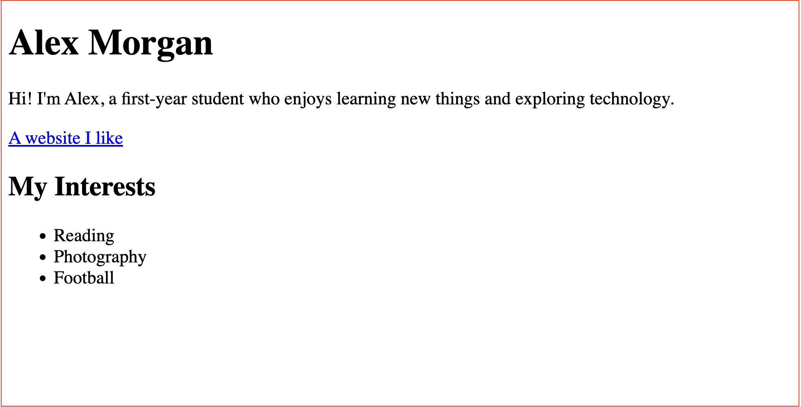

# Practice Task: My Mini Profile

**Time:** About 20 minutes  
**Goal:** Create a simple personal profile webpage using HTML.

## Target Page

---
## Your Task

Create an HTML file that matches the target page. Include:

- A page title shown in the browser tab
- A main heading with your name
- A short introduction about yourself
- A link to a website you like
- A list of three interests or hobbies

You may use your own name and details. Look up how to create a list in HTML; the list format is the new part of this task.

## Check Your Work

- Open your file in a web browser and make sure the page displays.
- Check that the link opens the website you chose.
- Make sure the page has exactly three interests.